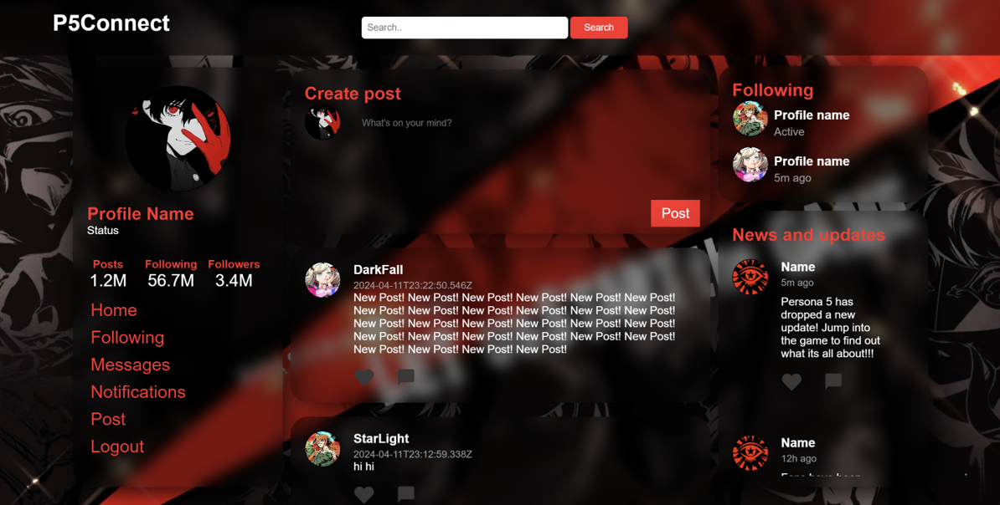

# P5Connect – Social Media Web Application

A browser-based social media web application built with HTML, CSS, JavaScript, Node.js, and MongoDB.

Users can register, sign in, create posts, follow other users, and view a personalised feed based on their connections.

The project demonstrates full-stack web development, REST-style APIs, session handling, and database integration without using external frontend frameworks.



## Tech Stack

- **HTML5** – Page structure and content
- **CSS3** – Layout and styling
- **JavaScript (ES6+)** – Client-side logic and interactivity
- **Node.js** – Backend runtime
- **Express.js** – Server and API routing
- **MongoDB** – Database for users, posts, and relationships
- **express-session** – Session-based authentication

## Core Features

- User registration with validation
- Secure login with session management
- Create and view posts
- Follow and unfollow users
- Personalised feed based on followed users
- Search for users
- Search for posts
- Persistent data storage using MongoDB

## Approach

The project was built using a structured, full-stack approach:

- The frontend is served as static files and communicates with the backend using `fetch` and JSON.
- The backend exposes REST-style endpoints for authentication, posting, searching, and user relationships.
- Session-based authentication is used to maintain logged-in user state.
- MongoDB collections are used to store users, posts, followers, and related data.
- Responsibilities are separated between frontend logic, server routes, and database access to keep the codebase organised and maintainable.

## How to Run

### Prerequisites
- Node.js
- MongoDB (running locally)

###  Run locally

1. Clone the repository:
    ```bash
    git clone https://github.com/Shanellze/P5Connect.git
    ```
2. Install dependencies:
    ```bash
    npm install
    ```
3. Ensure MongoDB is running locally on: `mongodb://127.0.0.1:27017`
4. Start the server:
    ```bash
    node server.js
    ```
5. Open your browser and navigate to: `http://localhost:8080`

## Known Limitations & Improvements

- Passwords are currently stored and compared in plain text. Hashing should be implemented to improve security.
- The interface allows selecting images for posts, but image upload and storage are not fully implemented.
- Like and comment features are visually present but are not yet saved or loaded from the database.
- The feed currently loads all posts at once. Adding pagination or lazy loading would improve scalability and performance.
- Client-side error handling and validation feedback are minimal and could be expanded to provide clearer user feedback.
- User profile data (such as status and profile picture) is displayed but cannot currently be edited by the user.
- Session handling is basic and would benefit from improved expiry management and a dedicated logout endpoint.